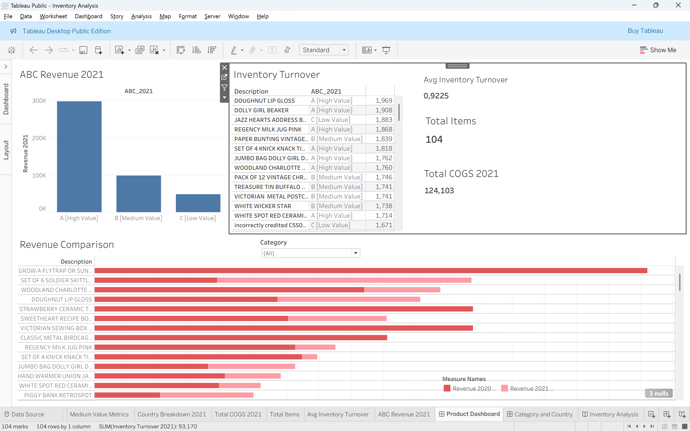

# Inventory Analysis 
## Project Overview  
This project analyzes inventory, sales, cost, and profit data to understand overall business performance.

## Project Objectives  
- Understand sales and inventory performance by product, category, and country  
- Identify products with the highest revenue contribution  
- Analyze profitability and production costs (COGS)  
- Evaluate inventory turnover  
- Support more efficient inventory management decisions  

## Dataset Overview  
The dataset covers the period 2020–2022 and consists of two main tables:

- Stock Table: SKU, product category, price, COGS, and stock quantity  
- Orders Table: transaction date, order quantity, country, and customer  

Key metrics analyzed:  
- Revenue  
- COGS (Cost of Goods Sold)  
- Profit  
- Inventory Turnover  

## Dashboard Preview  

### Product & ABC Analysis  

This dashboard highlights product performance using ABC Analysis, revenue comparison between 2020 and 2021, and inventory turnover to identify high‑value and fast‑moving products.

### Category & Country Analysis  

This dashboard shows category-level performance (revenue and COGS) and country breakdown, highlighting key markets and cost‑intensive product categories.

## Key Outputs & Insights  

The analysis shows that the **United Kingdom (UK)** recorded the highest number of orders and remains the main high‑value market. The **Decoration** category has the highest production costs (COGS), requiring tighter inventory control. **Home Accessories** generated the highest profit (around **$110,000** in 2020). Inventory turnover reached approximately **1.97%**, indicating fast‑moving products.  ABC analysis shows that **Class A products contribute around 70% of total revenue**.

## Tools  
- Tableau  

## Disclaimer  
This project was created for learning purposes only. The dataset is sourced from **DataCamp Case Studies** and does not represent real business conditions. All analyses and insights are based on simulated data for educational use.
